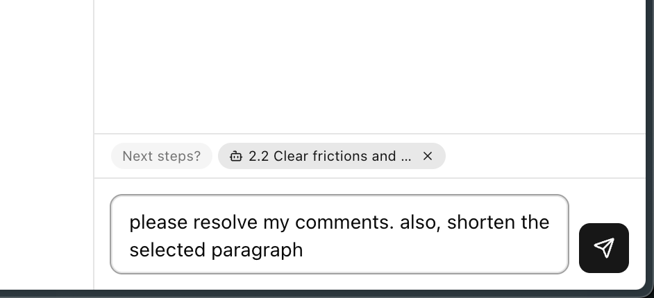
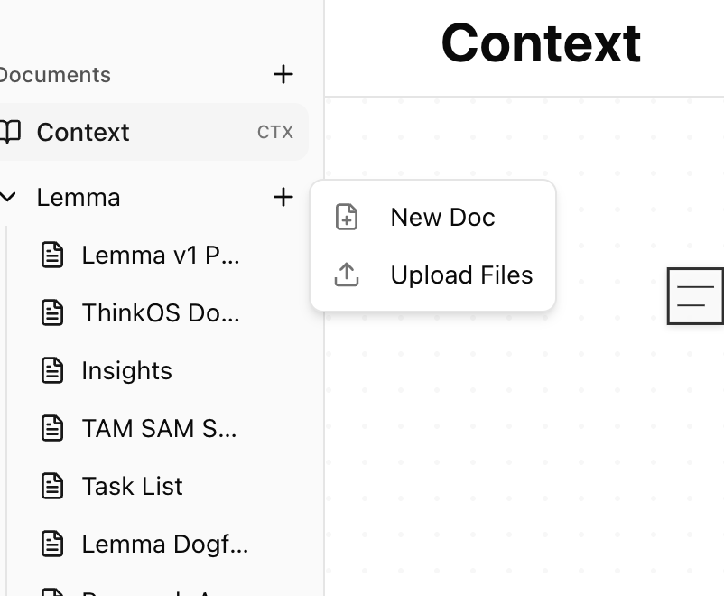
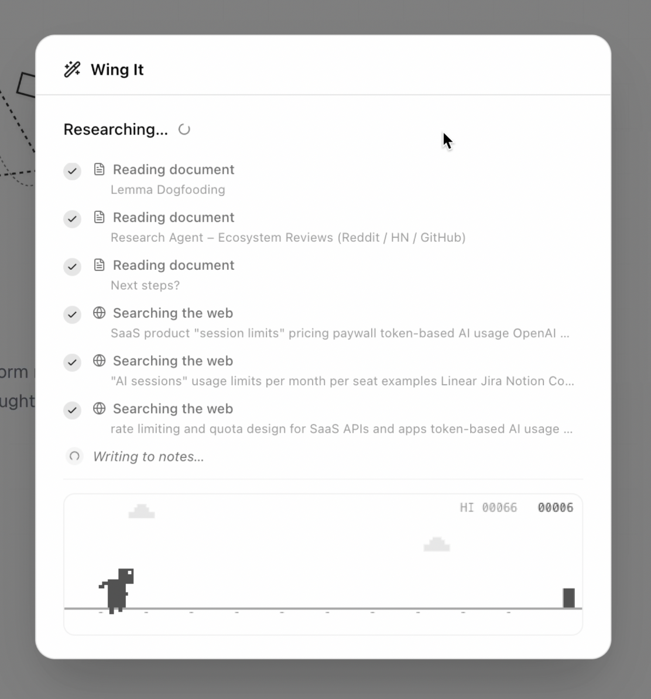
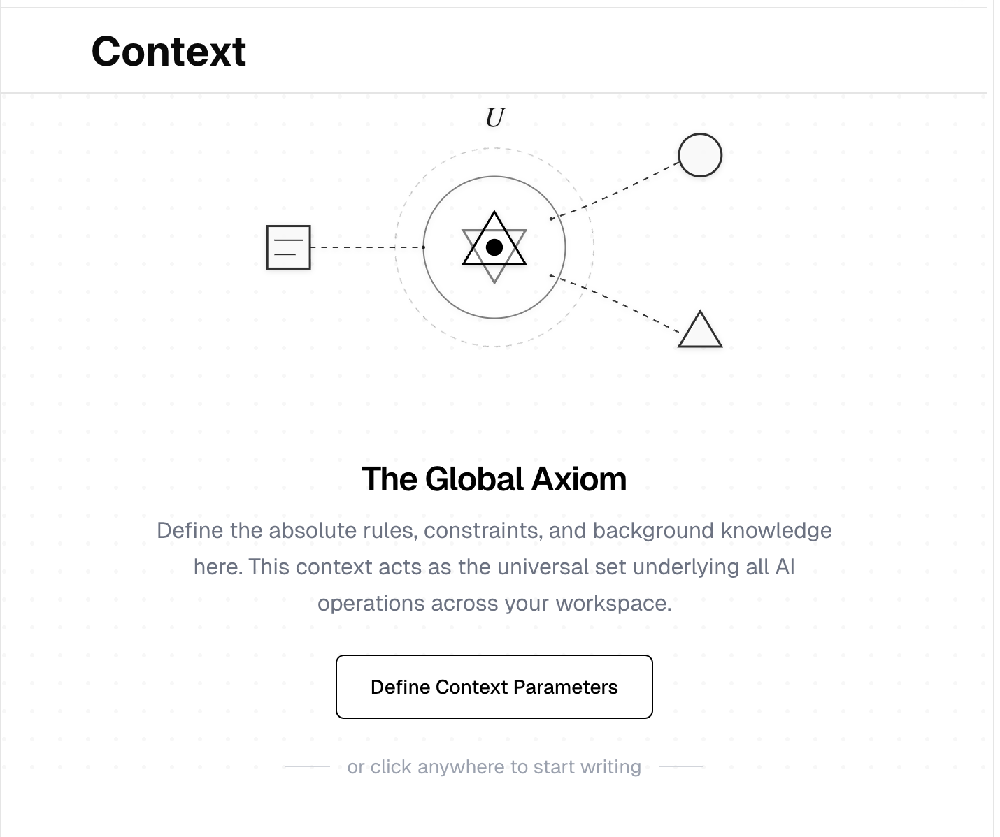

# Lemma

**The PRD writing tool for product managers who ship.**

Lemma is a purpose-built editor for writing product requirements documents. It combines a rich document editor with a context-aware AI sidebar and an automated research-to-draft pipeline called **Wing It** — so you can go from idea to spec in minutes, not hours.



## Features

### Rich Editor

A full-featured document editor built on [Plate.js](https://platejs.org) with everything you need for product specs:

- Headings, tables, callouts, code blocks, checklists, toggles, images, equations, and more
- Slash commands and keyboard shortcuts for fast formatting
- Drag-and-drop block reordering
- Import from Markdown, HTML, or DOCX
- Organize documents in folders



### AI Sidebar

A context-aware AI assistant that understands your documents:

- Sees the full document, your current selection, and inline comments
- Makes targeted edits directly in the editor — no copy-pasting
- Searches the web and reads URLs for up-to-date information
- Reads other documents in your workspace for cross-referencing
- Resolves comment threads on your behalf

### Wing It

Go from a topic to a complete first draft in three phases:

1. **Questioning** — The AI asks a few quick-fire questions to understand what you need
2. **Research** — Searches the web and reads your existing docs to gather context
3. **Writing** — Drafts a structured PRD with sections, success metrics, and technical considerations



### Context Documents

Define your product's constraints, terminology, and background knowledge in a **Context document**. This persistent context is injected into every AI operation across your workspace, so the AI always knows your product's domain.



### Comments

Inline comment threads with discussion support. The AI sidebar can read and resolve comments — ask it to address feedback, and it will edit the document and close the thread.

## Tech Stack

| Layer | Technology |
|---|---|
| Framework | [Next.js](https://nextjs.org) 16 (App Router, TypeScript) |
| Editor | [Plate.js](https://platejs.org) 52 (Slate-based, 40+ plugins) |
| Styling | [Tailwind CSS](https://tailwindcss.com) 4 + [shadcn/ui](https://ui.shadcn.com) |
| AI | [Vercel AI SDK](https://ai-sdk.dev) 6 + OpenAI |
| Backend | [Convex](https://convex.dev) (real-time database) |
| Auth | [Clerk](https://clerk.com) |
| Search | [Tavily](https://tavily.com) (web search + content extraction) |

## Getting Started

### Prerequisites

- Node.js 18+
- A [Convex](https://convex.dev) account
- A [Clerk](https://clerk.com) application
- An [OpenAI](https://platform.openai.com) API key
- A [Tavily](https://tavily.com) API key

### Setup

1. **Clone the repository**

   ```bash
   git clone https://github.com/sanky3008/lemma.git
   cd lemma
   ```

2. **Install dependencies**

   ```bash
   npm install
   ```

3. **Configure environment variables**

   Create a `.env.local` file:

   ```env
   # Convex
   NEXT_PUBLIC_CONVEX_URL=your_convex_url
   CONVEX_DEPLOYMENT=your_deployment_id

   # Clerk
   NEXT_PUBLIC_CLERK_PUBLISHABLE_KEY=your_clerk_publishable_key
   CLERK_SECRET_KEY=your_clerk_secret_key

   # AI
   OPENAI_API_KEY=your_openai_key
   TAVILY_API_KEY=your_tavily_key
   ```

4. **Start the Convex backend**

   ```bash
   npx convex dev
   ```

5. **Start the development server**

   ```bash
   npm run dev
   ```

   Open [http://localhost:3000](http://localhost:3000) to see the app.

## Project Structure

```
src/
├── app/
│   ├── (auth)/              # Sign-in, sign-up, SSO routes (Clerk)
│   ├── (marketing)/         # Public landing page
│   ├── app/                 # Main editor application
│   └── api/ai/              # AI endpoints (chat, wing-it)
├── components/
│   ├── app/                 # App components (editor, sidebar, chat, wing-it)
│   ├── editor/              # Plate.js plugin configuration
│   └── ui/                  # shadcn/ui + Plate UI components
├── lib/
│   ├── ai/                  # AI system (prompts, serialization, edit engine)
│   └── doc-store.tsx        # Document state management
└── hooks/                   # Custom React hooks

convex/
├── schema.ts                # Database schema
├── documents.ts             # Document CRUD
├── comments.ts              # Comment system
├── threads.ts               # Chat thread storage
├── wingIt.ts                # Wing It run tracking
└── users.ts                 # User sync from Clerk
```

## Scripts

```bash
npm run dev        # Start development server
npm run build      # Production build
npm start          # Run production server
npm run lint       # Lint with ESLint
```
